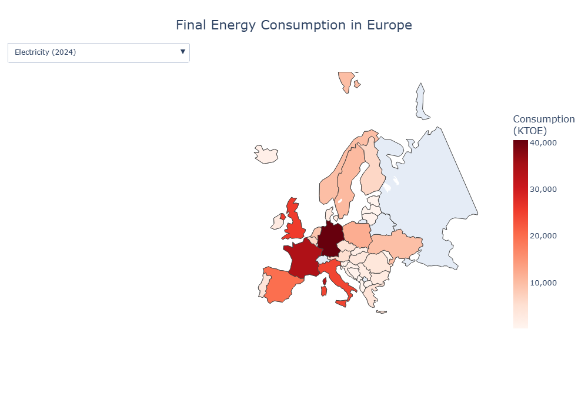

European Energy Consumption Analysis
A data‑driven exploration of energy usage patterns across European countries, including a focused comparison between Ireland and Ukraine.
Overview
This project analyzes European energy consumption using publicly available datasets.
It explores:
Country‑level energy consumption patterns
Long‑term trends in total and per‑capita usage
Regional differences across Europe
A detailed comparison between Ireland and Ukraine
The goal is to demonstrate strong skills in Python, data cleaning, exploratory analysis, visualization, and dashboard development.
Project Structure
european_energy_consumption/
│
├── data/
│   ├── clean_energy.csv
│   ├── demo_pjan_linear.zip
│   ├── estat_ten00123.tsv
│
├── images/
│   ├── elecricity_consumption_2024.png
│   ├── energy_analytics_dashboard.gif
│   ├── energy_consumption_heatmap.png 
│   ├── energy_consumption_stacked_bar_ireland.png
│   ├── fuel_consumption_bar_chart_ie_ua.png
│   ├── fuel_consumption_ireland_ukraine_2023.png
│   └── per_capita_energy_2023.png
│
├── notebooks/
│   ├── energy_consumption_analysis.ipynb
│   ├── energy_analytics_dashboard.ipynb
│
│
│
└── README.md
Key Insights
Northern and Western European countries show higher per‑capita consumption.
Eastern Europe displays strong growth trends in certain sectors.
Renewable energy adoption varies significantly between regions.
Ireland relies heavily on oil and natural gas, while Ukraine has a more diverse mix.
Ireland’s per‑capita consumption is significantly higher, driven by transport and services.
Ukraine shows major structural shifts in energy use after 2014 and 2022.

Methods & Tools
Data Processing
Cleaning missing values
Merging datasets
Calculating per‑capita consumption
Creating time‑series and regional aggregates
Country‑to‑country comparison analysis

Technologies Used
Python (Pandas, NumPy, Plotly, Dash)
Jupyter Notebook
Plotly Dash for interactive dashboard
GitHub for version control
Visualizations
## 📈 Electricity Consumption in 2024

Consumption Map

Ireland vs Ukraine Fuel Mix (2023)

Energy Consumption Trend

Dashboard Preview

Interactive Dashboard
The project includes a Dash application that allows users to explore:
Country‑level consumption
Year‑to‑year trends

